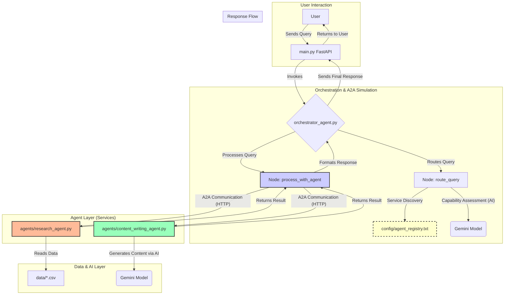

# Agent Orchestration System

This project demonstrates an agent orchestration system with two specialized agents and an orchestrator using LangGraph. The system mimics the Agent-to-Agent (A2A) protocol by having the orchestrator read agent information from a configuration file.

## Project Structure

```
.
├── agents/
│   ├── research_agent.py            # Research specialist agent
│   └── content_writing_agent.py     # Content writing specialist agent
├── config/
│   └── agent_registry.txt           # Agent registry file (A2A protocol simulation)
├── data/
│   └── *.csv                        # Sample data files for the research agent
├── orchestrator/
│   └── orchestrator_agent.py        # Orchestrator agent using LangGraph
├── main.py                          # Main script to run all components
└── requirements.txt                 # Python dependencies
```

## How It Works

1. The system consists of three main components:
   - **Research Agent**: Specializes in information retrieval, fact checking, and literature review
   - **Content Writing Agent**: Specializes in content creation, editing, and summarization
   - **Orchestrator Agent**: Routes user queries to the appropriate specialized agent

2. The A2A protocol is simulated through the `agent_registry.txt` file, which contains:
   - Agent names and descriptions
   - Endpoints for each agent
   - Capabilities of each agent

3. When a user submits a query:
   - The orchestrator analyzes the query
   - It determines which specialized agent is best suited to handle the request
   - It forwards the query to the selected agent
   - The agent processes the query and returns a response
   - The orchestrator returns the final response to the user

## Simulating the A2A Protocol

This project simulates a basic Agent-to-Agent (A2A) communication protocol. In a true A2A system, agents need a way to discover each other, understand their capabilities, and communicate. This repository mimics that process in the following way:

1.  **Service Discovery**: The `config/agent_registry.txt` file acts as a centralized service registry. Instead of agents broadcasting their presence, the orchestrator looks up available agents in this file.
2.  **Capability Assessment**: The registry contains a `description` and a list of `capabilities` for each agent. The orchestrator uses this information (with the help of an AI model) to assess which agent is best suited for a task, simulating a capability negotiation step.
3.  **Direct Communication**: Once an agent is selected, the orchestrator uses the `endpoint` from the registry to open a direct line of communication by sending an HTTP request, just as one agent would call another's API in a real A2A system.

This approach provides a simplified but effective model of how more complex, decentralized agent systems can be designed.

## Architecture Diagram



## Setup and Running

1. Ensure you have Python 3.8+ installed
2. Install the dependencies: `pip install -r requirements.txt`
3. Set your Google API key: `export GOOGLE_API_KEY='your-google-api-key'` (or use `set GOOGLE_API_KEY='your-google-api-key'` on Windows)
4. Run the system: `python main.py`

This will start:
- Research Agent on port 8001
- Content Writing Agent on port 8002
- Orchestrator API on port 8000

## API Usage

Send a query to the orchestrator:

```bash
curl -X POST "http://localhost:8000/query" \
     -H "Content-Type: application/json" \
     -d '{"query":"Can you research the latest developments in renewable energy and write a summary?"}'
```

## LangGraph Implementation
 
The orchestrator uses LangGraph to create a workflow that:
1. Routes the query to the appropriate agent
2. Processes the query with the selected agent
3. Returns the response to the user

The workflow is defined as a state graph with decision nodes that determine the flow based on the query content.

## Extending the System

To add more specialized agents:
1. Create a new agent server implementation
2. Add the agent details to the `agent_registry.txt` file
3. Update the orchestrator logic if needed to handle the new agent capabilities
